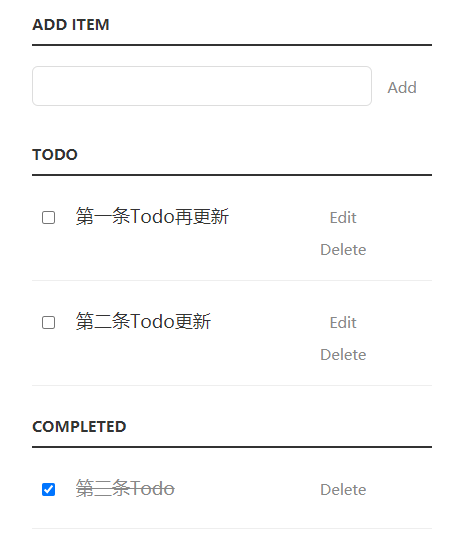

# todo
This is a simple and fine-look todo application


## Deployment

:rocket: [heroku](https://simple-fine-todo.herokuapp.com/)

## Run it on your :computer:
clone it
```shell script
git clone https://github.com/surzia/simple-fine-todo.git
```
```shell script
cd simple-fine-todo
```
install dependencies
```shell script
pip install -r requirements.txt
```
run as web application
```shell script
web: gunicorn app:app
```
or you can start it as flask app
```shell script
flask run
```

## Reference
- [Simple and Fine-look Todo App - From juejin](https://juejin.cn/post/6984787198499356680)
- [Simple to-do List - From Codepen](https://codepen.io/jaballadares/pen/Hwebq)